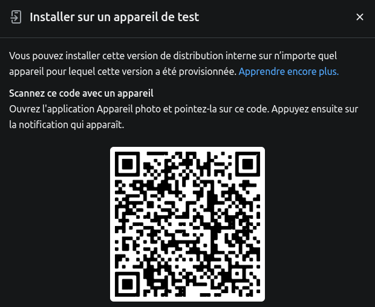

# PokeApp

PokeApp est une application mobile conçue pour les fans de Pokémon. Elle permet aux utilisateurs de gérer leur propre collection de Pokémon.

## Fonctionnalité 

1. **Ajout d'un Pokémon** : L'utilisateur peut ajouter un nouveau Pokémon à sa collection en entrant les détails du Pokémon. L'application peut générer automatiquement l'image du pokémon à partir de l'ID du pokémon sur le pokédex. Exemple : 001 pour Bulbizarre

2. **Visualisation de la collection** : L'utilisateur peut visualiser tous les Pokémon de sa collection dans un liste. Chaque Pokémon est présenté avec son image et son nom.

3. **Modification d'un Pokémon** : L'utilisateur peut modifier les détails d'un Pokémon existant dans sa collection.

4. **Suppression d'un Pokémon** : L'utilisateur peut supprimer un Pokémon de sa collection.

## Installation pour le développement

Si vous souhaitez exécuter l'application sur votre machine pour le développement, suivez les étapes ci-dessous :

1. **Cloner le dépôt** : Clonez ce dépôt sur votre machine locale en utilisant la commande `git clone`.

2. **Installer les dépendances** : Naviguez vers le répertoire du projet et installez les dépendances nécessaires en utilisant la commande `npm install`.

3. **Lancer le projet** : Une fois que toutes les dépendances sont installées, vous pouvez lancer le projet en utilisant la commande ` npx expo start`.

## Installation de la version build

Vous pouvez télécharger l'application en scannant ce QR Code :

